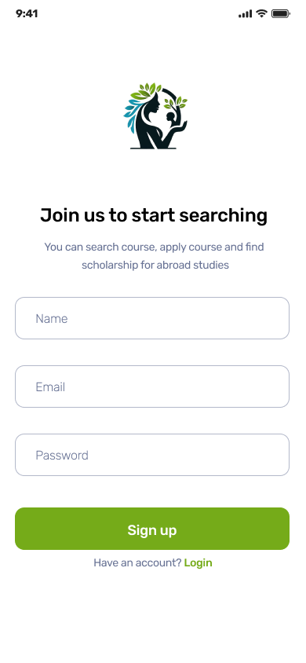
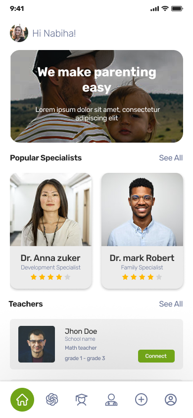

<br><br>

<!-- project philosophy -->


>Guardian Grove provides convenient access to professional guidance and support for parents.
>
>Our mission is to bridge the gap between professional advice and parental needs, empowering users in their journey of nurturing and growth through communication and personalized support.

## User Stories

### parent

- As a parent, I want to book appointments with psychologists through the app, so I can seek professional guidance conveniently.
- As a parent, I want to recieve techers reports, so I can track my child behaviour in the school.
- As a parent, I want to chat with AI, so I can get immediate advice on samll details.

### Teacher

- As a teacher, i want to send reports to the prent's student, so that i can ensure the student is raised well
- As a teacher, i want to edit my profile, so that i can represent my self properly for parents
- As a teacher, i want to cht with the prent, so that i can discuss anything about their child  

### Psychologist

- As a psychologist, I want to manage my schedule and make available times visible, so I can optimize my time and offer convenient slots to users.
- As a psychologist, I want to receive feedback from users, so I can improve services and understand their needs better.
- As a psychologist, I want to engage in follow-up chat discussions with parentss, so I can provide continuous assistance beyond scheduled appointments.

### Admin

- As an admin, I want to oversee psychologists qualifications and user reviews, so I can uphold standards of service.
- As an admin, I want to receive reports and feedback from users, so I can address issues promptly and improve the user experience.
- As an admin, I want to be able to delete users, so I can ensure the platform's integrity.

<br><br>
<!-- Tech stack -->


###  Guardian Grove is built using the following technologies:

- This project uses [Node.js](https://nodejs.org/en) for its backend runtime environment. Node.js allows us to build scalable and efficient server-side applications using JavaScript.
- [Express](https://expressjs.com/) is used as the web application framework for building the RESTful API. Express simplifies routing and handling HTTP requests and responses.
- For database interactions, the project uses [Prisma](https://www.prisma.io/), an ORM that makes database access easy with type safety and auto-generated queries.
- The entire backend is written in [TypeScript](https://www.typescriptlang.org/), which adds static types to JavaScript, enhancing code quality and maintainability.
- For real-time communication and live chatting, [Socket.IO](https://socket.io/) is implemented, providing bi-directional communication between clients and servers.
- Notifications are handled using [Firebase](https://firebase.google.com/), a platform that provides various tools including cloud messaging for sending push notifications.
- The administration panel is powered by [Electron](https://www.electronjs.org/), enabling the development of cross-platform desktop applications using web technologies. Electron offers a seamless integration of web technologies, allowing for the creation of robust and efficient desktop applications.
- The web application is built using [Vite](https://vitejs.dev/), a next-generation frontend tooling that provides fast build times and a smooth development experience.
- React is used for building the user interface. [React](https://react.dev/) is a powerful library for creating dynamic and responsive web applications.
- The mobile application is developed using [Expo](https://expo.dev/), a framework and platform for universal React applications. Expo simplifies the development and deployment process for mobile apps.
- For handling push notifications on mobile devices, the project uses [Expo Notifications](https://docs.expo.dev/push-notifications/sending-notifications/), which supports sending and receiving push notifications on both iOS and Android platforms.

<br><br>
<!-- UI UX -->


> We designed Coffee Express using wireframes and mockups, iterating on the design until we reached the ideal layout for easy navigation and a seamless user experience.

- Project Figma design [figma](https://www.figma.com/file/LsuOx5Wnh5YTGSEtrgvz4l/Purrfect-Pals?type=design&node-id=257%3A79&mode=design&t=adzbABt5hbb91ucZ-1)


### Mockups
| Sign Up Screen | Home Screen | Psycologist Profile Screen |
| ---| ---| ---|
|  |  |  |

<br><br>

<!-- Database Design -->


###  Architecting Data Excellence: Innovative Database Design Strategies:


<br><br>


<!-- Implementation -->


### User Screens (Mobile)
| Login screen  | Register screen | Landing screen | Loading screen |
| ---| ---| ---| ---|
|  |  |  |  |
| Home screen  | Menu Screen | Order Screen | Checkout Screen |
|  |  |  |  |

### Admin Screens (Web)
| Login screen  | Register screen |  Landing screen |
| ---| ---| ---|
|  |  |  |
| Home screen  | Menu Screen | Order Screen |
|  |  |  |

<br><br>


<!-- Prompt Engineering -->


###  Mastering AI Interaction: Unveiling the Power of Prompt Engineering:


<br><br>

<!-- AWS Deployment -->


### By following these steps, we deployed the backend with AWS Integration:


Step 1: Update AWS Packages

```sh 
sudo apt update
```

Step 2: Install Required Stacks

```sh 
sudo apt install mysql-server nodejs npm
```

Step 3: Create The Database

```sh 
sudo mysql -u root -p
CREATE DATABASE guardian_grove_db;
```

Step 4: Clone the Repository

```sh 
git clone https://github.com/AliAbdelAall/Guardian-Grove.git
```

Step 5: Install The Packages

```sh 
cd Guardian-Grove/backend/
npm install
```

Step 6: Create Node Environment Configuration

```sh 
cp .env.example .env
```

Step 7: Migrate To Generate Tables In The Database

```sh
npx prisma migrate
```

step 8: start the server with the start script

```sh
npm start 
```

<br><br>

<!-- Unit Testing -->


###  Precision in Development: Harnessing the Power of Unit Testing:


<br><br>


<!-- How to run -->


> To set up Coffee Express locally, follow these steps:

### Prerequisites

This is an example of how to list things you need to use the software and how to install them.
* npm
  ```sh
  npm install npm@latest -g
  ```

### Installation

_Below is an example of how you can instruct your audience on installing and setting up your app. This template doesn't rely on any external dependencies or services._

1. Get a free API Key at [example](https://example.com)
2. Clone the repo
   git clone [github](https://github.com/your_username_/Project-Name.git)
3. Install NPM packages
   ```sh
   npm install
   ```
4. Enter your API in `config.js`
   ```js
   const API_KEY = 'ENTER YOUR API';
   ```

Now, you should be able to run Coffee Express locally and explore its features.